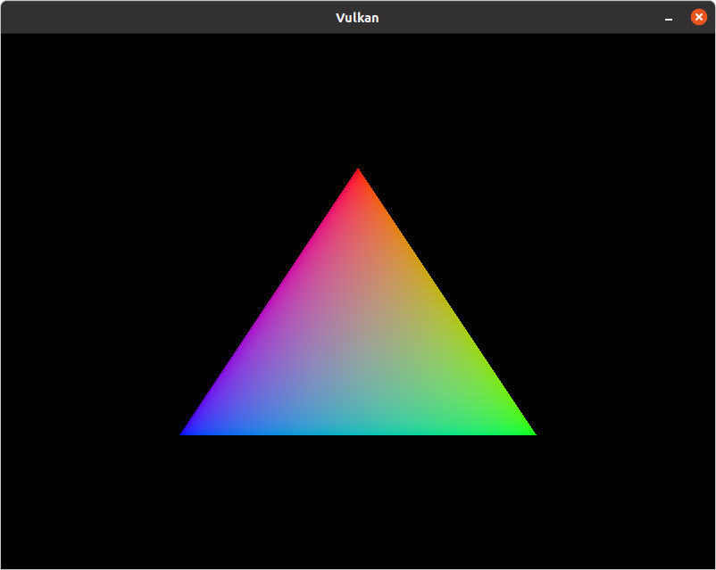

# vulkanLearning
personal repository for learning vulkan, non reusable stuff, just following [vulkan-tutorial.com](https://vulkan-tutorial.com/).

Note: [the tutorial follows the Vulkan 1.0 spec mostly](https://www.khronos.org/registry/vulkan/specs/1.0/html/)

This repository is set up for CLion 2020.1.2 on Ubuntu 20.04

On Ubuntu 20.04 Focal Fossa, could only make the validation layers work after installing at system level. 
After a lot of pain I gave up on using the LunarG SDK, instead I am getting everything from the apt repository too. 

GLFW and GLM are in the repo itself, but because I imagine if I were to develop a cross-platform application I would add them
in the project to save the headache of dealing with multiple different package managers in different systems for things 
not vulkan. 

Package `vulkan-tools` is needed for command-line utilities, most importantly vulkaninfo and vkcube. Useful to confirm my machine is Vulkan-capable.
The package `libvulkan-dev` installs the Vulkan loader.

    sudo apt install vulkan-validationlayers-dev libvulkan-dev vulkan-tools
    
***WARNING:*** *never reinstall* `libvulkan1`, a ton of things depends on it and when I tried it blew up my system, so if 
the above doesn't work, be patient and look for help.    

---

On CLion, install the [GLSL Support](https://plugins.jetbrains.com/plugin/6993-glsl-support) plugin from the marketplace.
This will make it easier to write *.frag and *.vert files (fragment and vertex shaders).

Don't install [shaderc](https://github.com/google/shaderc), on Ubuntu I downloaded the [binaries](https://storage.googleapis.com/shaderc/badges/build_link_linux_clang_release.html)
and picked only the `glslc` binary and placed it under `/usr/local/`. You can get the  [**`glslc ↓`**](https://drive.google.com/uc?export=download&confirm=c8GS&id=1koFW-DJjkRWG5IMBVgz7rsDUaZRIWVyP)  I used too.

We use `glslc` int the `shaders/compile.sh` script to build the spirv shaders.

*the triangle*

